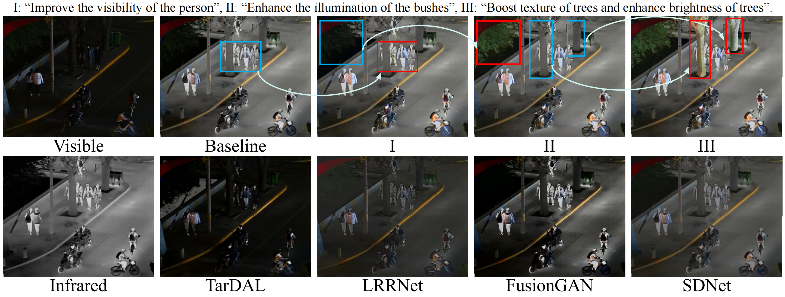
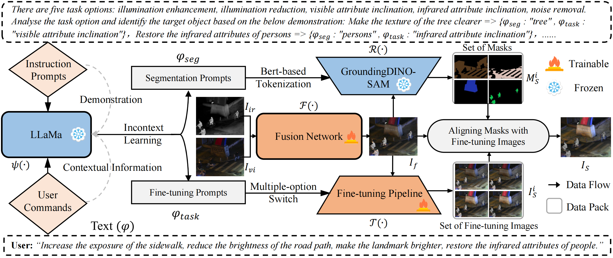

# TeRF

# Implement of TeRF

Code for TeRF: Text-driven and Region-aware Flexible Visible and Infrared Image Fusion


###### Configuration requirements before development

1. Python  3.7.0
2. Pytorch 1.12.1

### Runing Tips

1. Install the libraries and weights required for the large model
2. Training the fusion backbone
3. Runing the main.py
   
### Contributor

Baixuzx7 @ wanghebaixu@gmail.com

### Copyright statement

The project is signed under the MIT license, see the [LICENSE.txt](https://github.com/Baixuzx7/TeRF/main/LICENSE.txt)

### Architecture of TeRF



### Reference
```
@inproceedings{wang2024terf,
  title={TeRF: Text-driven and Region-aware Flexible Visible and Infrared Image Fusion},
  author={Wang, Hebaixu and Zhang, Hao and Yi, Xunpeng and Xiang, Xinyu and Fang, Leyuan and Ma, Jiayi},
  booktitle={ACM Multimedia 2024},
  year={2024}
}
```
